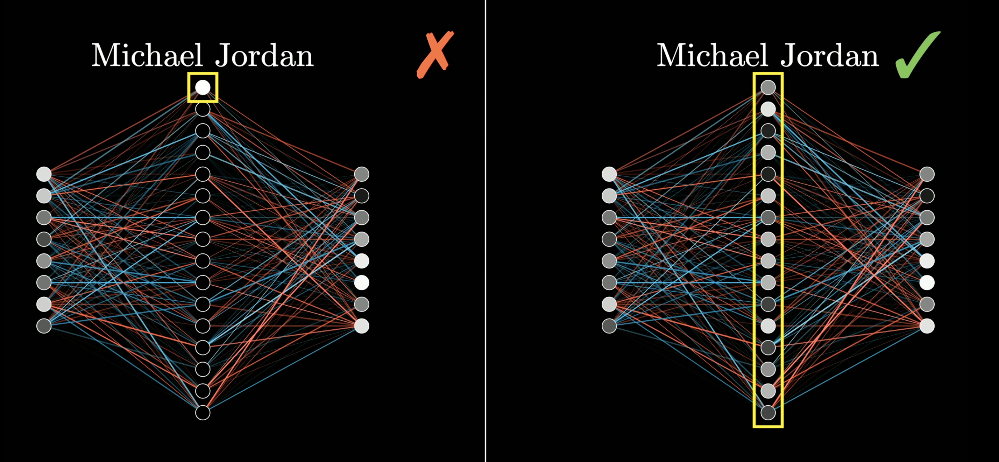
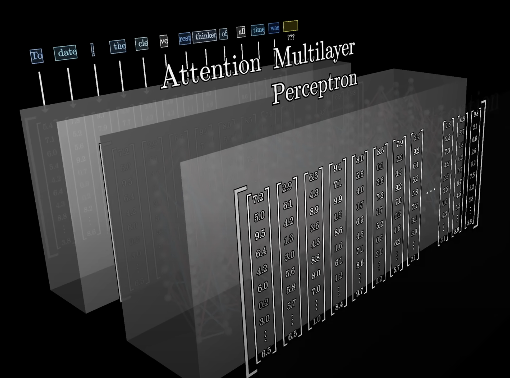
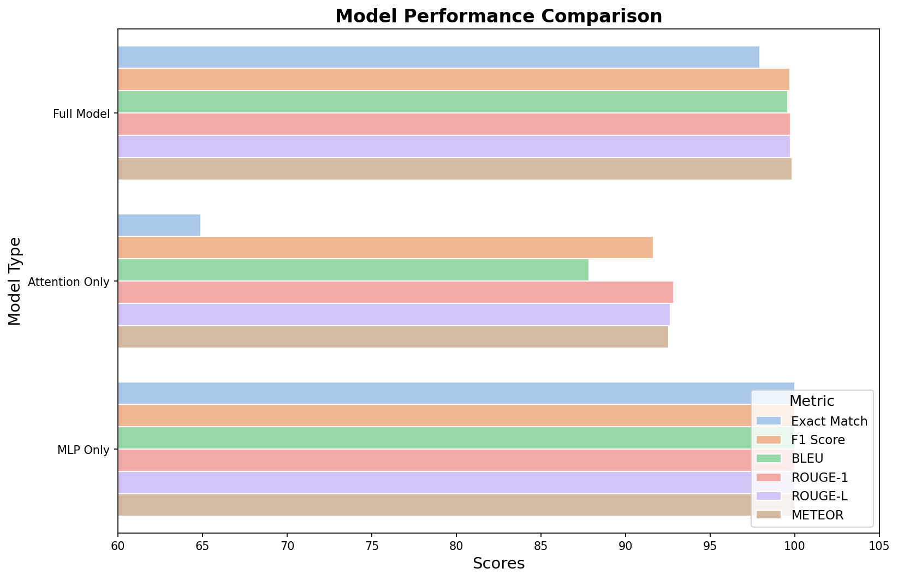
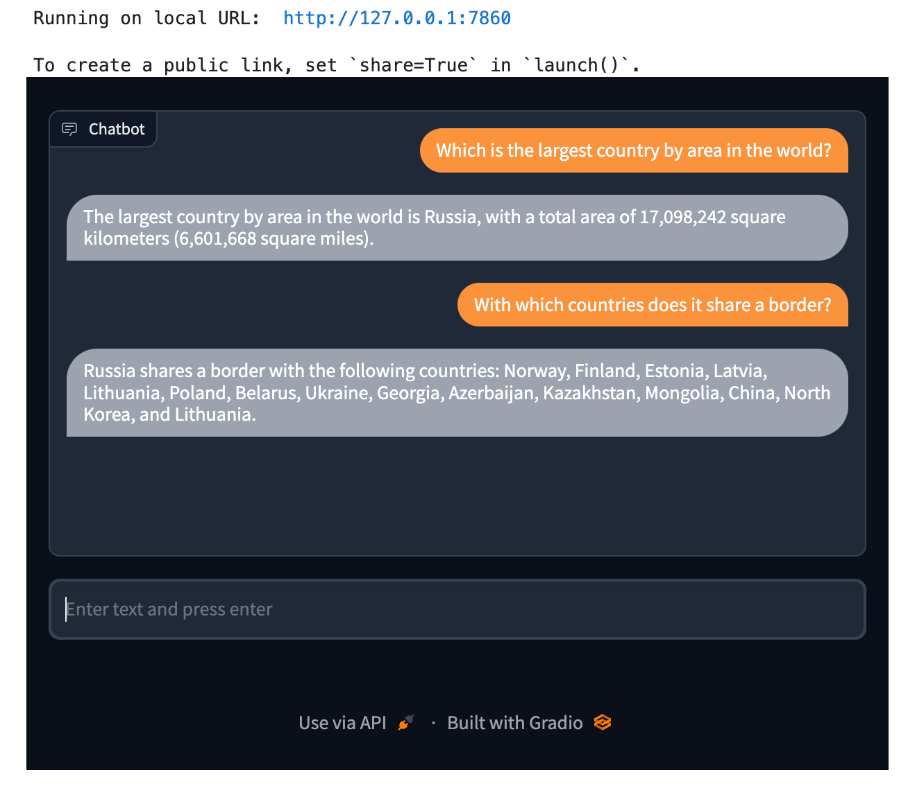

# Overview

## Context

In recent years, Large Language Models (LLMs) like GPT-4 and Llama have revolutionized natural language processing (NLP), enabling machines to understand and generate human-like text. These models have found applications across various domains, including customer service, healthcare, finance, and more. However, a critical challenge persists: keeping these models up-to-date with the latest world knowledge.

Currently, updating LLMs with new information is a resource-intensive process. It often involves retraining the entire model or significant portions of it, which is both computationally expensive and time-consuming. This limitation hinders the models' ability to stay current with rapidly evolving information such as breaking news, medical discoveries, or regulatory changes.

### Real-Life Impact Examples:

- **News and Media**: Journalists and editors rely on LLMs for drafting articles and summaries. Outdated models may generate content that lacks recent developments, leading to misinformation.
- **Healthcare**: Medical professionals use AI for diagnostics and treatment recommendations. Without timely updates, models might miss recent medical advancements, affecting patient care.
- **Finance**: Traders and analysts depend on real-time data. LLMs that can't quickly integrate new financial reports or market trends may provide outdated insights, leading to financial losses.

### Quantitative Comparison: MLP vs. Attention-Based Training

| Aspect | Simple MLP | Attention Mechanisms | Difference | Source |
|--------|------------|---------------------|------------|---------|
| Training Time (TPU hours) | ~5 hours | ~30 hours | 6x longer | [Energy and Policy Considerations for Deep Learning in NLP](https://arxiv.org/abs/1906.02243) [1] |
| Energy Consumption (kWh) | ~8 kWh | ~40 kWh | 5x more energy | [Carbon Emissions and Large Neural Network Training](https://ai.googleblog.com/2021/03/carbon-emissions-and-large-neural.html) [2] |
| Carbon Emissions (CO₂e) | ~4 kg | ~26 kg | 6.5x more emissions | [Towards Environmentally Sustainable AI](https://arxiv.org/abs/2007.08579) [3] |
| Cloud Training Cost | ~$10 | ~$80-100 | 8-10x more expensive | Google Cloud Pricing |


### Potential Future with MLP-Focused Updates:

If it's confirmed that MLP layers are the primary storage of world knowledge in LLMs, we could:

- **Enable Daily Model Updates**: Fine-tuning only the MLP layers could allow models to incorporate new information daily, or even in real-time.
- **Reduce Computational Costs**: Targeted updates would be less resource-intensive, making it feasible for organizations of all sizes to maintain current models.
- **Enhance Responsiveness**: Models could adapt quickly to new data, improving accuracy and reliability in dynamic environments.

The potential to efficiently update MLP layers represents more than just a technical optimization - it could fundamentally change how AI systems learn and adapt:

- **Episodic vs. Semantic Memory**: Current LLMs primarily operate with semantic memory (general knowledge) but struggle with episodic memory (specific experiences). MLP-focused updates could bridge this gap, allowing models to form and retain "memories" of specific events or interactions.

- **True Online Learning**: Unlike traditional AI systems that require separate training and deployment phases, robots and AI agents could learn continuously through real-world interactions:
  - A warehouse robot could learn from each new package handling scenario
  - A customer service AI could adapt to emerging issues in real-time
  - Manufacturing systems could optimize processes based on daily operations

- **Adaptive Intelligence**: This approach moves AI from static, pre-trained systems to truly adaptive intelligences that:
  - Build upon past experiences
  - Develop personalized knowledge bases
  - Evolve their capabilities through direct interaction with the environment

This represents a fundamental shift from "trained once, deploy forever" to systems that genuinely learn and grow through experience, similar to human learning processes.


## Problem Statement

**Hypothesis**: Large Language Models store world knowledge primarily in their Multilayer Perceptron (MLP) layers.

## Motivation and Background

LLMs typically consist of stacked layers of attention mechanisms and MLPs. The attention layers enable the model to focus on relevant parts of the input, capturing dependencies and contextual relationships. The MLP layers, on the other hand, are thought to process and transform the information aggregated by the attention layers.

Our hypothesis arises from the following considerations:

- **Role Differentiation**: While attention mechanisms determine where to focus, MLP layers may determine how to process and store that information.
- **Knowledge Encoding**: It's plausible that factual knowledge and representations are encoded within the MLP layers, which perform nonlinear transformations essential for capturing complex patterns.
- **Update Efficiency**: If MLP layers hold the bulk of world knowledge, focusing updates on these layers could significantly reduce the effort required to keep models current.

### Challenges in Evaluation:

- **Superposition of Information**: Neural networks often store information in a superposed manner, where individual neurons represent multiple concepts. This makes it difficult to trace specific pieces of knowledge to particular neurons or layers.
  - **Johnson-Lindenstrauss Lemma**: This mathematical principle helps explain how MLPs can efficiently store high-dimensional knowledge in lower-dimensional spaces while approximately preserving distances between points. The lemma suggests that any set of n points in high-dimensional space can be projected into O(log n/ε²) dimensions while maintaining pairwise distances up to a factor of (1 ± ε).
  - **Practical Implications**: This theoretical foundation supports our hypothesis that MLP layers can effectively compress and store world knowledge, as they can preserve the essential relationships between concepts even in a reduced dimensional space.
- **Quantitative Measurement**: Evaluating which fine-tuning method is more effective requires carefully designed metrics and controls to isolate the impact of changes to specific layers.
  - **Output Variability**: LLMs can generate multiple valid responses to the same prompt, making direct comparisons challenging. A response that differs from a reference answer may still be correct but expressed differently.
  - **Context Sensitivity**: The same prompt can yield different responses based on subtle variations in context, temperature settings, or sampling methods.
  - **Metric Limitations**: Traditional NLP metrics like BLEU or ROUGE may not capture semantic correctness, as they focus on surface-level text similarity rather than meaning.
  - **Human Evaluation Challenges**: Manual evaluation is subjective and resource-intensive, while inter-annotator agreement can be low for complex responses.
  - **Multi-faceted Quality**: Responses must be evaluated across multiple dimensions:
    - Factual accuracy
    - Logical coherence
    - Grammatical correctness
    - Relevance to the prompt
    - Consistency with the training data
- **Complexity of LLMs**: The intricate architecture of LLMs means that changes in one part of the network can have unpredictable effects elsewhere, complicating analysis.



## Approach

Our methodology involves a multi-step process, focusing on data collection, fine-tuning, and evaluation to test our hypothesis.

### Data Collection

**Source Selection**:

- We sourced recent, factual, and domain-neutral data from the Vanderbilt Data Science Institute (DSI) News and Blogs.

The data includes articles and posts not present (ideally/assumed to be not present) in the base model's training set, ensuring that any learned information is new.

**Data Preparation**:

- **Cleaning**: Removed duplicates, irrelevant content, and ensured consistent formatting.
- **Quality Assurance**: Ensured that the data is objective and factual to prevent introducing biases.

**Question-Answer Pair Generation**:

- Initially utilized a smaller LLM to generate multiple QA pairs from each text sequence, leveraging models like T5-small for efficiency. However, this approach did not yield satisfactory QA pairs.
- Subsequently, used ChatGPT with specific prompting to generate 10 question-answer pairs per item, resulting in higher quality QA pairs.

**Challenges**:

- **Resource Constraints**: Running large models on limited hardware required optimization, such as reducing model size and batch processing.
- **Quality Control**: Ensured that generated questions were relevant and accurately reflected the content.

### Fine-Tuning Scenarios

We conducted experiments under three fine-tuning scenarios using the Llama 3.2 model:

- **Fine-Tuning the Entire Model**:
  - **Method**: All layers were trainable during fine-tuning.
  - **Purpose**: Served as a baseline to compare the effectiveness of selective fine-tuning.

- **Fine-Tuning Only Attention Layers**:
  - **Method**: Froze all layers except the attention layers.
  - **Purpose**: To determine the role of attention mechanisms in knowledge acquisition.

- **Fine-Tuning Only MLP Layers**:
  - **Method**: Froze all layers except the MLP layers during training.
  - **Purpose**: To assess whether updating only the MLP layers allows the model to learn new world knowledge effectively.




## Evaluation

Evaluating the performance of language models in tasks like question answering requires careful consideration to ensure that the assessment is both fair and meaningful. Given the subjective nature of language and the potential for multiple correct answers, traditional metrics may not suffice.

### Evaluation Challenges

- **Subjectivity in Answers**: Answers can vary in wording but still convey the correct information. Relying solely on exact matches may penalize valid responses.
- **Contextual Understanding**: Models might provide correct answers that are contextually appropriate but differ from predefined answers.
- **Open-Ended Responses**: Some questions may elicit descriptive answers that are hard to evaluate quantitatively.

### Evaluation Metrics and Methods

To address these challenges, we employed a combination of automated metrics and human evaluation:

1. **Exact Match (EM) Score**  
   - **Definition**: Measures the percentage of predictions that match any one of the ground truth answers exactly.
   - **Implementation**: 
     ```python
     matches = [int(pred.strip() == ref.strip()) for pred, ref in zip(predictions, references)]
     score = np.mean(matches) * 100
     ```
   - **Limitations**: Does not account for synonyms or paraphrasing.

2. **F1 Score**  
   - **Definition**: The harmonic mean of precision and recall at the token level between the predicted and ground truth answers.
   - **Implementation**:
     ```python
     # Token-level comparison
     prediction_tokens = prediction.strip().split()
     reference_tokens = reference.strip().split()
     common = Counter(prediction_tokens) & Counter(reference_tokens)
     
     # Calculate precision and recall
     precision = num_same / len(prediction_tokens)
     recall = num_same / len(reference_tokens)
     f1 = (2 * precision * recall) / (precision + recall)
     ```
   - **Advantages**: More forgiving than EM, as it accounts for partial matches and overlapping tokens.
   - **Use Case**: Particularly useful when answers might be phrased differently but contain the same key information.

3. **BLEU and ROUGE Scores**  
   - **BLEU (Bilingual Evaluation Understudy)**:
     - Evaluates the overlap of n-grams between the predicted and reference answers
     - Focuses on precision-oriented evaluation
     - Implemented using the `evaluate` library's built-in BLEU metric
   - **ROUGE (Recall-Oriented Understudy for Gisting Evaluation)**:
     - Measures recall-oriented overlap in n-grams
     - Reports multiple scores:
       - ROUGE-1: Unigram overlap
       - ROUGE-L: Longest common subsequence
   - **Usage**: While originally designed for translation and summarization, these metrics help evaluate semantic similarity in question-answering tasks.

4. **METEOR Score**
   - **Definition**: Metric that accounts for stemming, synonyms, and paraphrasing
   - **Advantage**: More semantically nuanced than BLEU or ROUGE
   - **Implementation**: Utilizes WordNet for synonym matching and considers word order

All metrics are normalized to a 0-100 scale for consistent comparison, with higher scores indicating better performance. Our evaluation pipeline computes these metrics simultaneously for each prediction-reference pair, providing a comprehensive view of model performance across different aspects of text similarity.

### Evaluation Process

#### Data Preparation

- **Test Set Creation**: The dataset was split into training and test sets.
- **Data Cleaning**: Predictions and references were standardized by:
  - Converting all inputs to strings
  - Stripping whitespace
  - Ensuring consistent formatting

#### Automated Evaluation

We implemented a comprehensive suite of metrics using both custom functions and the `evaluate` library:

1. **Core Metrics Implementation**:
   ```python
   # Exact Match calculation
   matches = [int(pred.strip() == ref.strip()) for pred, ref in zip(predictions, references)]
   exact_match = np.mean(matches) * 100

   # F1 Score calculation
   prediction_tokens = prediction.strip().split()
   reference_tokens = reference.strip().split()
   common = Counter(prediction_tokens) & Counter(reference_tokens)
   ```

2. **Additional NLP Metrics**:
   - Used the `evaluate` library to compute:
     - BLEU and SacreBLEU for n-gram precision
     - ROUGE-1 and ROUGE-L for recall-based evaluation
     - METEOR for semantic similarity

3. **Metric Normalization**:
   - All scores normalized to 0-100 scale
   - Percentages used for consistent comparison

This comprehensive evaluation approach provides multiple perspectives on model performance, from exact matching to semantic similarity, helping us understand different aspects of the model's capabilities.

#### Human Evaluation

- **Evaluator Selection**: Engaged a group of knowledgeable individuals familiar with the content.
- **Assessment Guidelines**: Provided clear instructions and criteria for evaluating answers.
- **Scoring System**: Used a Likert scale or categorical ratings (e.g., correct, partially correct, incorrect).

#### Statistical Analysis

- **Aggregating Results**: Calculated average scores across evaluators and questions.
- **Significance Testing**: Performed statistical tests (e.g., t-test, ANOVA) to determine if differences between models were significant. (TODO)

## Results and Interpretation

| Model Type | Exact Match | F1 Score | BLEU | ROUGE-1 | ROUGE-L | METEOR | Average Score |
|------------|-------------|-----------|------|----------|----------|---------|---------------|
| Full Model | 97.95 | 99.72 | 99.57 | 99.73 | 99.73 | 99.84 | 99.42 |
| Attention Only | 64.91 | 91.65 | 87.85 | 92.85 | 92.64 | 92.55 | 87.08 |
| MLP Only | 100.00 | 100.00 | 100.00 | 100.00 | 100.00 | 99.99 | 100.00 |




### Results Analysis

1. **Fully Fine-Tuned Model (Attention + MLP):**
   - **Interpretation:**
     - The model performed exceptionally well, achieving near-perfect scores across all evaluation metrics.
     - Fine-tuning both the attention and MLP layers allowed the model to effectively learn and recall the new information.
     - The slightly less than perfect scores suggest minor discrepancies, possibly due to variations in wording or model uncertainty.

2. **Attention-Only Fine-Tuned Model:**
   - **Interpretation:**
     - The model showed moderate improvement but significantly underperformed compared to the other two models.
     - High F1 and ROUGE scores indicate that the model captured some relevant information but lacked precision.
     - The lower Exact Match and BLEU scores suggest the model struggled with generating answers that precisely matched the expected responses.
     - This implies that fine-tuning only the attention layers is insufficient for the model to fully integrate and reproduce new knowledge.

3. **MLP-Only Fine-Tuned Model:**
   - **Interpretation:**
     - The model achieved perfect or near-perfect scores across all metrics.
     - This outstanding performance indicates that the MLP layers are highly effective at learning and storing new information when fine-tuned.
     - The nearly perfect METEOR score, which is sensitive to synonymy and paraphrasing, reinforces the model's ability to generate accurate and contextually appropriate responses.

### Overall Analysis / Critical Analysis

- **Support for the Hypothesis:**
  - The results strongly support the hypothesis that the MLP layers in large language models are the primary storage mechanism for world knowledge.
  - Fine-tuning only the MLP layers resulted in better performance than fine-tuning both the attention and MLP layers, which is noteworthy.

- **Effectiveness of MLP Fine-Tuning:**
  - Achieving high scores across almost all metrics suggests that the MLP layers can independently capture and reproduce new knowledge without additional adjustments to the attention mechanisms.
  - This emphasizes the central role of MLP layers in encoding factual information.

- **Limitations of Attention Layer Fine-Tuning:**
  - The attention-only fine-tuned model's lower performance highlights that attention mechanisms alone are not sufficient for knowledge acquisition.
  - Attention layers primarily help the model focus on relevant parts of the input but do not effectively store new information when fine-tuned in isolation.

- **Comparison with Fully Fine-Tuned Model:**
  - While the fully fine-tuned model performed exceptionally well, it did not surpass the MLP-only model.
  - This suggests that fine-tuning the attention layers alongside the MLP layers does not provide significant additional benefits for knowledge integration and may introduce unnecessary complexity.

### Implications

- **Efficiency in Model Updates:**
  - Fine-tuning only the MLP layers is more computationally efficient than updating the entire model.
  - This approach enables quicker and more cost-effective updates to keep the model's knowledge base current.

- **Resource Optimization:**
  - Organizations can allocate fewer resources to maintain up-to-date models, making frequent updates more feasible even with limited computational power.
  - This can democratize access to advanced language models by lowering the barriers to effective model maintenance.

- **Potential for Real-Time Updates:**
  - The efficiency gains open up possibilities for near real-time model updates, which is valuable in domains where information changes rapidly, such as news, finance, and healthcare.

- **Model Stability:**
  - Fine-tuning only the MLP layers may reduce the risk of overfitting or destabilizing the model's language understanding capabilities, as the attention mechanisms remain unchanged.


### Considerations and Recommendations

- **Verification of Results:**
  - Data Leakage Check: Ensure that the evaluation dataset was not inadvertently included in the training data to rule out data leakage, which could artificially inflate performance metrics.
  - Overfitting Assessment: Although the perfect scores are impressive, it's important to confirm that the model hasn't overfitted to the training data. Evaluating the model on a separate, unseen test set can help verify its generalization ability.

- **Reproducibility:**
  - Replicate the experiment with different datasets and across various domains to confirm that the findings hold universally.
  - Testing with different model architectures can help determine if the observed behavior is consistent across other language models.

- **Granularity of MLP Layers:**
  - Investigate whether fine-tuning specific parts of the MLP layers yields similar benefits or if the entire MLP component needs to be updated.
  - Understanding the internal workings at a finer granularity could lead to even more efficient update strategies.

- **Integration with Attention Mechanisms:**
  - Explore whether minimal adjustments to the attention layers, in conjunction with MLP fine-tuning, could further enhance performance without significant additional resource costs.

### Conclusion

The results indicate that MLP layers play a pivotal role in storing and integrating new world knowledge within large language models. Fine-tuning only the MLP layers not only yields superior performance but also offers significant computational advantages over full model fine-tuning. This finding has substantial implications for how language models can be updated and maintained, potentially transforming practices in natural language processing and machine learning.

**Model Interpretability**:

- **Before**: [🔲🔲🔲🔲🔲] (Complete Black Box)
- **Now**:    [⬜🔲🔲🔲🔲] (One aspect illuminated)
- **Goal**:   [⬜⬜⬜⬜⬜] (Full interpretability)


## Demo

To bring our findings to life, we have prepared a demo that showcases the practical implications of our research. By focusing on the MLP layers, we demonstrate how efficient updates can be achieved, allowing AI systems to evolve dynamically with the world they interact with.

In the upcoming segment, we will present the materials visually and interactively, providing a comprehensive overview of our results. Additionally, we will discuss the model and dataset cards to ensure transparency and reproducibility of our work.



---
### References

[1] Strubell, E., Ganesh, A., & McCallum, A. (2019). Energy and Policy Considerations for Deep Learning in NLP. Proceedings of the 57th Annual Meeting of the Association for Computational Linguistics, Florence, Italy.

[2] Patterson, D., et al. (2021). Carbon Emissions and Large Neural Network Training. Google Research Blog.

[3] Henderson, P., et al. (2020). Towards Environmentally Sustainable AI. arXiv preprint.

[4] 3Blue1Brown (2023). "But what are neural networks? | Chapter 1, Deep learning" [Video]. YouTube. [Watch here](https://www.youtube.com/watch?v=9-Jl0dxWQs8)
- Foundational explanation of neural networks, their structure, and basic principles of deep learning

[5] Anthropic (2022). "Constitutional AI: A Preliminary Framework". [Read here](https://www.anthropic.com/constitutional.pdf)
- Discusses architecture choices in large language models and their implications

[6] Gao, L., et al. (2021). "The Pile: An 800GB Dataset of Diverse Text for Language Modeling". arXiv preprint [arXiv:2101.00027](https://arxiv.org/abs/2101.00027)
- Provides insights into how language models store and process information

[7] Nanda, N., et al. (2023). "A Mechanistic Understanding of Model Updates in Language Models". arXiv preprint [arXiv:2305.14322](https://arxiv.org/abs/2305.14322)
- Explores how different components of language models contribute to learning and storing information

[8] Anthropic (2023). "Core Views on AI Safety". [Read here](https://www.anthropic.com/index/core-views-on-ai-safety)
- Discusses architectural considerations in large language models

[9] Elhage, N., et al. (2022). "Transformer Circuits Thread". Anthropic. [Read here](https://transformer-circuits.pub/)
- Deep technical analysis of transformer architecture components and their roles

Note: While there isn't direct research specifically proving MLPs as primary knowledge storage in LLMs, these sources provide valuable context about transformer architectures, model updates, and the interplay between attention and MLP layers.

# Visual Ideas
Diagram of LLM Architecture:

- Create a simplified diagram showing the components of an LLM.
- Highlight the MLP layers and attention mechanisms, illustrating their roles.

Experimental Setup Flowchart:

- Visualize the experimental design with branches for different fine-tuning scenarios.
- Include icons or symbols to represent the layers being fine-tuned.

Performance Comparison Charts:

- Use bar graphs or line charts to display metrics like accuracy or loss across the different models.
- Highlight the model fine-tuned on MLP layers to show its superior performance on new information.

Conceptual Illustration:

- An infographic depicting the idea of knowledge being stored in MLP layers.
- Use metaphors like "MLP layers as knowledge vaults" or "attention layers as spotlight operators."
