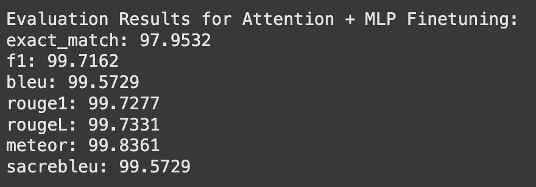

# Overview

## Context

In recent years, Large Language Models (LLMs) like GPT-4 and Llama have revolutionized natural language processing (NLP), enabling machines to understand and generate human-like text. These models have found applications across various domains, including customer service, healthcare, finance, and more. However, a critical challenge persists: keeping these models up-to-date with the latest world knowledge.

Currently, updating LLMs with new information is a resource-intensive process. It often involves retraining the entire model or significant portions of it, which is both computationally expensive and time-consuming. This limitation hinders the models' ability to stay current with rapidly evolving information such as breaking news, medical discoveries, or regulatory changes.

### Real-Life Impact Examples:

- **News and Media**: Journalists and editors rely on LLMs for drafting articles and summaries. Outdated models may generate content that lacks recent developments, leading to misinformation.
- **Healthcare**: Medical professionals use AI for diagnostics and treatment recommendations. Without timely updates, models might miss recent medical advancements, affecting patient care.
- **Finance**: Traders and analysts depend on real-time data. LLMs that can't quickly integrate new financial reports or market trends may provide outdated insights, leading to financial losses.

### Potential Future with MLP-Focused Updates:

If it's confirmed that MLP layers are the primary storage of world knowledge in LLMs, we could:

- **Enable Daily Model Updates**: Fine-tuning only the MLP layers could allow models to incorporate new information daily, or even in real-time.
- **Reduce Computational Costs**: Targeted updates would be less resource-intensive, making it feasible for organizations of all sizes to maintain current models.
- **Enhance Responsiveness**: Models could adapt quickly to new data, improving accuracy and reliability in dynamic environments.

(Placeholder for Image 1: A comparative diagram showing the current full-model update process versus the proposed MLP-only update process, highlighting efficiency gains.)

## Problem Statement

**Hypothesis**: Large Language Models store world knowledge primarily in their Multilayer Perceptron (MLP) layers.

## Motivation and Background

LLMs typically consist of stacked layers of attention mechanisms and MLPs. The attention layers enable the model to focus on relevant parts of the input, capturing dependencies and contextual relationships. The MLP layers, on the other hand, are thought to process and transform the information aggregated by the attention layers.

Our hypothesis arises from the following considerations:

- **Role Differentiation**: While attention mechanisms determine where to focus, MLP layers may determine how to process and store that information.
- **Knowledge Encoding**: It's plausible that factual knowledge and representations are encoded within the MLP layers, which perform nonlinear transformations essential for capturing complex patterns.
- **Update Efficiency**: If MLP layers hold the bulk of world knowledge, focusing updates on these layers could significantly reduce the effort required to keep models current.

### Challenges in Evaluation:

- **Superposition of Information**: Neural networks often store information in a superposed manner, where individual neurons represent multiple concepts. This makes it difficult to trace specific pieces of knowledge to particular neurons or layers.
- **Quantitative Measurement**: Evaluating which fine-tuning method is more effective requires carefully designed metrics and controls to isolate the impact of changes to specific layers.
- **Complexity of LLMs**: The intricate architecture of LLMs means that changes in one part of the network can have unpredictable effects elsewhere, complicating analysis.

(Placeholder for Image 2: An illustration depicting superposition in neural networks, showing overlapping representations within neurons.)

## Approach

Our methodology involves a multi-step process, focusing on data collection, fine-tuning, and evaluation to test our hypothesis.

### Data Collection

**Source Selection**:

- We sourced recent, factual, and domain-neutral data from the Vanderbilt Data Science Institute (DSI) News and Blogs.

The data includes articles and posts not present in the base model's training set, ensuring that any learned information is new.

**Data Preparation**:

- **Cleaning**: Removed duplicates, irrelevant content, and ensured consistent formatting.
- **Text Preprocessing**: Applied normalization techniques, such as lowercasing and removing special characters.
- **Quality Assurance**: Ensured that the data is objective and factual to prevent introducing biases.

**Question-Answer Pair Generation**:

- Utilized a smaller LLM to generate multiple QA pairs from each text sequence, leveraging models like T5-small for efficiency.

**Challenges**:

- **Resource Constraints**: Running large models on limited hardware required optimization, such as reducing model size and batch processing.
- **Quality Control**: Ensured that generated questions were relevant and accurately reflected the content.

(Placeholder for Image 3: A flowchart showing the data collection and preprocessing pipeline, from sourcing to QA pair generation.)

### Fine-Tuning Scenarios

We conducted experiments under three fine-tuning scenarios using the Llama 3.2 model:

- **Fine-Tuning Only MLP Layers**:
  - **Method**: Froze all layers except the MLP layers during training.
  - **Purpose**: To assess whether updating only the MLP layers allows the model to learn new world knowledge effectively.

- **Fine-Tuning Only Attention Layers**:
  - **Method**: Froze all layers except the attention layers.
  - **Purpose**: To determine the role of attention mechanisms in knowledge acquisition.

- **Fine-Tuning the Entire Model**:
  - **Method**: All layers were trainable during fine-tuning.
  - **Purpose**: Served as a baseline to compare the effectiveness of selective fine-tuning.

(Placeholder for Image 4: Diagrams of the LLM architecture for each scenario, highlighting which layers are fine-tuned in each case.)

## Evaluation

Evaluating the performance of language models in tasks like question answering requires careful consideration to ensure that the assessment is both fair and meaningful. Given the subjective nature of language and the potential for multiple correct answers, traditional metrics may not suffice.

### Evaluation Challenges

- **Subjectivity in Answers**: Answers can vary in wording but still convey the correct information. Relying solely on exact matches may penalize valid responses.
- **Contextual Understanding**: Models might provide correct answers that are contextually appropriate but differ from predefined answers.
- **Open-Ended Responses**: Some questions may elicit descriptive answers that are hard to evaluate quantitatively.

### Evaluation Metrics and Methods

To address these challenges, we employed a combination of automated metrics and human evaluation:

1. **Exact Match (EM) Score**  
   - **Definition**: Measures the percentage of predictions that match any one of the ground truth answers exactly.
   - **Limitations**: Does not account for synonyms or paraphrasing.

2. **F1 Score**  
   - **Definition**: The harmonic mean of precision and recall at the token level between the predicted and ground truth answers.
   - **Advantages**: More forgiving than EM, as it accounts for partial matches and overlapping tokens.

3. **BLEU and ROUGE Scores**  
   - **BLEU (Bilingual Evaluation Understudy)**: Evaluates the overlap of n-grams between the predicted and reference answers.
   - **ROUGE (Recall-Oriented Understudy for Gisting Evaluation)**: Focuses on recall, measuring the amount of overlap in n-grams.
   - **Usage**: Commonly used in machine translation and summarization tasks.

4. **Human Evaluation**  
   - **Process**: Human evaluators assess the correctness and relevance of model-generated answers.
   - **Criteria**:
     - **Correctness**: Whether the answer is factually accurate.
     - **Completeness**: Whether the answer addresses all aspects of the question.
     - **Fluency**: The grammatical and stylistic quality of the answer.
     - **Inter-Annotator Agreement**: Ensuring consistency among evaluators by measuring agreement scores.

### Evaluation Process

#### Data Preparation

- **Test Set Creation**: Compiled a set of questions related to the new information introduced during fine-tuning.
- **Answer Variability**: For each question, included multiple acceptable answers to account for different phrasings.

#### Automated Evaluation

- **Model Predictions**: Each fine-tuned model generated answers to the test questions.
- **Metric Calculation**: Computed EM and F1 scores for each model.
- **Limitations Acknowledged**: Recognized that automated metrics might not capture all correct answers due to wording differences.

#### Human Evaluation

- **Evaluator Selection**: Engaged a group of knowledgeable individuals familiar with the content.
- **Assessment Guidelines**: Provided clear instructions and criteria for evaluating answers.
- **Scoring System**: Used a Likert scale or categorical ratings (e.g., correct, partially correct, incorrect).

#### Statistical Analysis

- **Aggregating Results**: Calculated average scores across evaluators and questions.
- **Significance Testing**: Performed statistical tests (e.g., t-test, ANOVA) to determine if differences between models were significant.

### Results and Interpretation

(Placeholder for Image 5: A table or graph displaying evaluation metrics—EM, F1, human evaluation scores—across the three fine-tuning scenarios.)

#### Model Performance

- **MLP-Fine-Tuned Model**:
  - **Automated Metrics**: Achieved higher EM and F1 scores compared to other models.
  - **Human Evaluation**: Received higher correctness and completeness ratings.

- **Attention-Fine-Tuned Model**:
  - **Automated Metrics**: Showed marginal improvements over the baseline.
  - **Human Evaluation**: Answers were often incomplete or less accurate.

- **Fully Fine-Tuned Model**:
  - **Automated Metrics**: Similar to the MLP-fine-tuned model but with diminishing returns considering the additional resources required.
  - **Human Evaluation**: Comparable performance to the MLP-fine-tuned model.

### Analysis

- **Effectiveness of MLP Fine-Tuning**:  
  The MLP-fine-tuned model demonstrated a superior ability to recall and apply new information, suggesting that MLP layers play a significant role in knowledge storage.

- **Limitations of Attention Layer Fine-Tuning**:  
  Fine-tuning only the attention layers did not yield substantial gains, indicating that these layers may not be primarily responsible for encoding new factual knowledge.

- **Resource Considerations**:  
  While fully fine-tuning the model achieved good performance, it required more computational resources, making MLP-only fine-tuning a more efficient alternative.

### Considerations and Challenges

- **Subjectivity in Human Evaluation**:  
  - **Mitigation**: Used multiple evaluators and calculated inter-annotator agreement to ensure reliability.

- **Data Biases**:  
  Acknowledged that the dataset's domain specificity (Vanderbilt DSI content) may influence the generalizability of the results.

- **Model Limitations**:  
  Recognized that even the best-performing model might not capture all nuances, and further improvements are possible.

### Conclusion on Evaluation

The combination of automated metrics and human evaluation provided a more comprehensive assessment of model performance. While automated metrics offer quantifiable measures, human evaluation captures subtleties that metrics might miss.

## Summary of Results

Our experiments revealed the following:

- **MLP-Fine-Tuned Model**:
  - **Performance**: Achieved the highest accuracy and lowest perplexity among the three models.
  - **Interpretation**: Suggests that MLP layers are critical for storing and integrating new world knowledge.

- **Attention-Fine-Tuned Model**:
  - **Performance**: Showed minimal improvement over the baseline, indicating limited capacity for knowledge acquisition when only attention layers are updated.
  - **Interpretation**: Reinforces the idea that attention mechanisms primarily facilitate the focus on input features rather than storing knowledge.

- **Fully Fine-Tuned Model**:
  - **Performance**: Comparable to the MLP-fine-tuned model but required more computational resources and time.
  - **Interpretation**: Updating the entire model doesn't significantly outperform targeted MLP fine-tuning for knowledge acquisition.

### Critical Analysis and Considerations:

- **Superposition and Distributed Representations**:
  - While results support the hypothesis, the possibility that knowledge is distributed across layers cannot be entirely ruled out.
  - Further research is needed to understand the interplay between different layers fully.

- **Evaluation Challenges**:
  - Quantitative differences, though significant, may be influenced by factors such as training dynamics and optimization processes.
  - A more extensive dataset and varied evaluation metrics could provide deeper insights.

(Placeholder for Image 6: A bar chart comparing model performance metrics, highlighting the superiority of the MLP-fine-tuned model.)

## Implications

Our findings have significant implications for the development and deployment of LLMs:

### Efficient Model Updates

- **Current Limitations**: Full model updates are impractical for frequent knowledge integration due to resource constraints.
- **Proposed Solution**: Focusing on MLP layers enables efficient updates, making it feasible to incorporate new information regularly.

### Real-Time Adaptability

- **Applications**:
  - **News and Media**: Models can provide up-to-date summaries and insights, enhancing the value of AI in journalism.
  - **Healthcare**: Rapid integration of new medical research can improve diagnostic tools and patient outcomes.
  - **Finance**: Real-time data assimilation allows for more accurate market analysis and decision-making.

### Robotics and On-the-Job Learning

- **Advancements**:
  - Robots and AI agents can adapt to new environments and tasks by updating their MLP layers with relevant information.
  - Promotes the development of more autonomous and versatile AI systems.

### Architectural Insights

- **Targeted Development**:
  - Understanding the distinct roles of model components allows for more focused improvements in architecture design.
  - Could lead to models that are inherently more efficient and easier to update.

### Ethical and Security Considerations

- **Data Quality**:
  - Emphasizes the importance of high-quality, unbiased data to prevent propagating misinformation.
  - Requires robust data validation processes during updates.

- **Security Risks**:
  - Potential for malicious data injection if update mechanisms are not secure.
  - Necessitates the development of safeguards against unauthorized or harmful updates.

(Placeholder for Image 7: An infographic depicting the potential applications and benefits of MLP-focused updates in various industries.)

## Segue to Next Segment

Our exploration into the storage of world knowledge within LLMs opens new avenues for making AI systems more dynamic and responsive. By honing in on the MLP layers, we can achieve efficient updates, paving the way for AI that evolves alongside the world it interacts with.

In the next segment, we'll delve into the presentation materials, providing a visual and interactive showcase of our findings. We'll also discuss the model and dataset cards, ensuring transparency and reproducibility of our work.

(Placeholder for Image 8: A sneak peek of the interactive demo interface or a key visualization from the presentation.)

# Visual Ideas
Diagram of LLM Architecture:

- Create a simplified diagram showing the components of an LLM.
- Highlight the MLP layers and attention mechanisms, illustrating their roles.

Experimental Setup Flowchart:

- Visualize the experimental design with branches for different fine-tuning scenarios.
- Include icons or symbols to represent the layers being fine-tuned.

Performance Comparison Charts:

- Use bar graphs or line charts to display metrics like accuracy or loss across the different models.
- Highlight the model fine-tuned on MLP layers to show its superior performance on new information.

Conceptual Illustration:

- An infographic depicting the idea of knowledge being stored in MLP layers.
- Use metaphors like "MLP layers as knowledge vaults" or "attention layers as spotlight operators."
